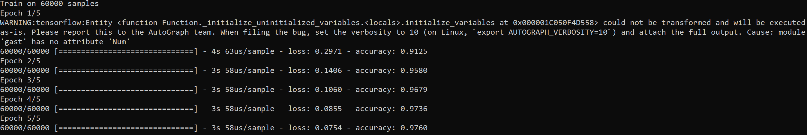
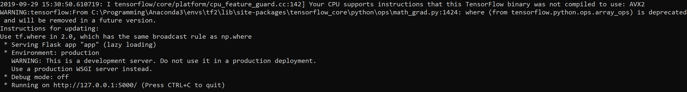
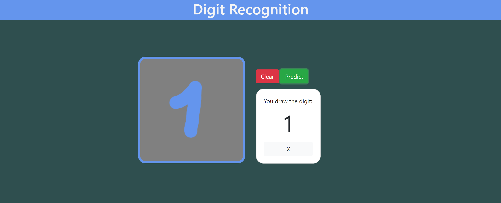

# DIGIT-RECOGNITION

:date: Creation date: July 2019 

## :dart: Objective

The neural network is trained on the MNIST dataset provided by the Keras API. It goal is to recognize handwritten digits.

## :black_nib: Description

Once the web application is launched, the user can draw a digit in a drawing area. After that, the user clicks on the "Predict" button and the neural network returns its prediction.

## :rocket: How to start the application?

To download and install the dependencies:
```
pip install -r requirements.txt
```
To train the neural network (:warning: mandotory for a first use):
```
python train.py
```
To launch the web application:
```
python app.py
```
To access the application in a web browser, enter this address in the search bar:
```
http://127.0.0.1:5000/
```

## :eyes: Overview

Training:



Launch of the web application:



Web application:





